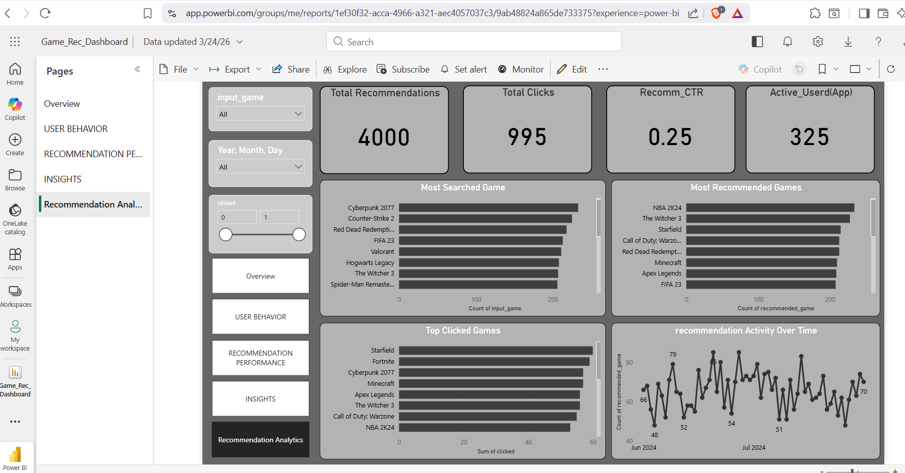
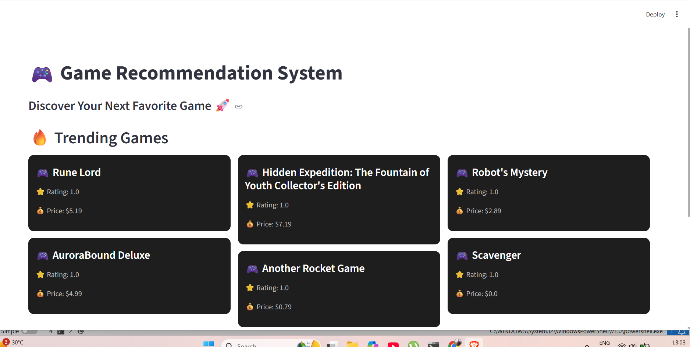
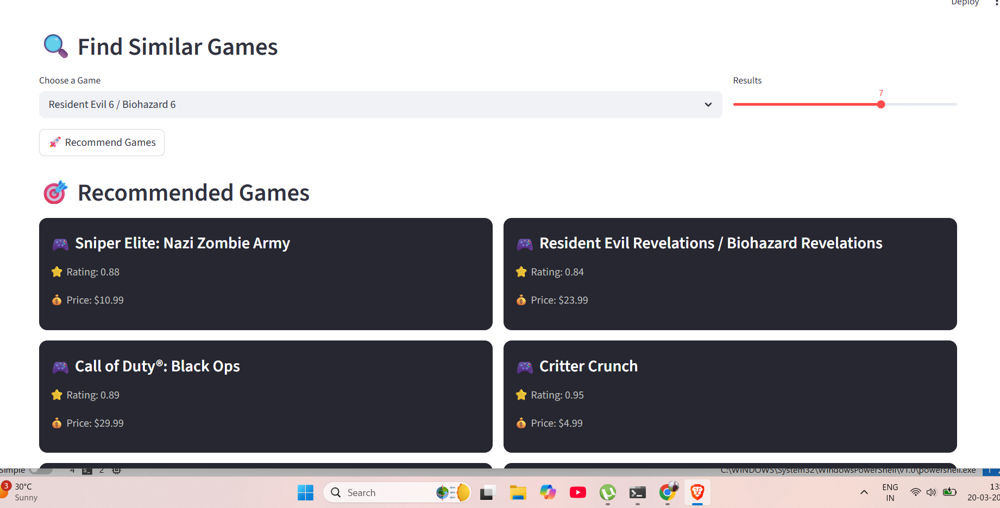

# 🎮 Game Recommendation System

A Machine Learning-based **Game Recommendation System** that suggests games based on user preferences using a **Hybrid Recommendation Approach (Content-Based + Similarity)**.

🚀 Built to help users discover new games intelligently.

---

## 🌐 Live Demo

🚧 Streamlit App  

👉 Run locally:

```bash
streamlit run app.py


📊 Power BI Dashboard (Live)



🚀 Project Overview

This project recommends games by analyzing multiple features such as:

🎯 Genre
📝 Game Description
⭐ Ratings
🎮 Features

It uses Natural Language Processing (NLP) and similarity-based techniques to generate accurate recommendations.

🧠 Machine Learning Approach
Content-Based Filtering using TF-IDF Vectorization
Similarity computation using Cosine Similarity
Hybrid logic combining multiple features for better recommendations
✨ Features
🔍 Search any game and get recommendations
⚡ Fast and optimized recommendation engine
🎨 Interactive UI using Streamlit
📊 Power BI dashboard for insights
🧾 Recommendation logging system
📂 Project Structure
Game_Recommendation_System/
│
├── app.py
├── requirements.txt
├── games.csv
├── recommendations_log.csv
├── screenshots/
├── README.md
📊 Dataset

The dataset contains:

Game Name
Genre
Description
Rating
Platform
Features

📌 Size: 40,000+ rows

⚙️ Installation & Setup
1️⃣ Clone the Repository
git clone https://github.com/GauravSuryawanshi085/Game_Recommendation_System.git
cd Game_Recommendation_System
2️⃣ Install Dependencies
pip install -r requirements.txt
3️⃣ Run the Application
streamlit run app.py
💻 How It Works
User enters a game name
System processes input using ML model
Displays top recommended games
📊 Power BI Dashboard

The project includes a live analytics dashboard built using Power BI.

🔹 Key Insights
📈 Recommendation trends over time
🎮 Most recommended games
👤 User interaction behavior
🔍 Popular search patterns

## 📸 Screenshots

### 🎮 App Home


### 🔍 Recommendations


### 📊 Dashboard


🧾 Resume Highlights
Developed a Hybrid Game Recommendation System using Machine Learning
Applied TF-IDF & Cosine Similarity for recommendations
Built an interactive UI using Streamlit
Designed Power BI dashboard for analytics
Implemented user interaction logging system
🔮 Future Improvements
Add Collaborative Filtering
Deep Learning-based recommendations
Cloud deployment
User authentication system
🛠️ Tech Stack
Python
Pandas
NumPy
Scikit-learn
Streamlit
Power BI
👨‍💻 Author

Gaurav Suryawanshi
Aspiring Data Scientist / ML Engineer

🔗 GitHub: https://github.com/GauravSuryawanshi085

⭐ Support

If you like this project, give it a ⭐ on GitHub!
